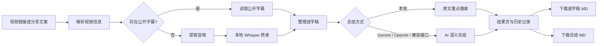

# 留文 · WENL SCRIBE 开发进度

> 文档日期：2026-07-21
> 当前阶段：本地可用原型，核心转录、总结、历史与 Markdown 导出链路已经贯通。

## 1. 项目定位

留文是一款本地优先的 B 站视频转录与内容整理工具。用户粘贴普通 B 站链接、`b23.tv` 短链或完整分享文案后，系统自动获取视频信息、生成逐字稿、提炼内容总结，并分别提供 Markdown 下载。

当前产品重点不是单纯“下载字幕”，而是建立一条可追溯的内容处理链路：



## 2. 当前运行快照

| 项目 | 当前状态 |
|---|---|
| 本地前端 | 正常，`http://localhost:3001/` 返回 200 |
| 本地后端 | 正常，`http://127.0.0.1:8765/` 健康检查通过 |
| 当前总结服务 | Gemini API |
| 当前模型 | `gemini-3.5-flash` |
| API Key | 本机检测到已配置；本文不读取、不记录密钥内容 |
| 历史任务 | 8 个：5 个完成、2 个失败、1 个处理中 |
| 最近构建 | 通过 |
| Python 语法检查 | 通过 |
| ESLint | 0 个错误，保留 2 个图片优化提示 |

任务数量属于 2026-07-21 检查时的瞬时状态，后续运行会继续变化。

## 3. 已完成功能

### 3.1 链接与视频解析

- 支持普通 B 站视频链接。
- 支持 `b23.tv` 短链接跳转解析。
- 支持直接粘贴带标题的完整分享文案。
- 自动读取标题、作者、时长、封面、BV 号和视频来源地址。
- 封面通过本地代理加载，规避 B 站防盗链导致的空白问题。

### 3.2 字幕与本地转录

- 优先获取公开视频字幕，避免不必要的语音识别。
- 无公开字幕时自动获取视频音频并调用本地 `faster-whisper`。
- 支持 `large-v3-turbo`、`medium`、`small` 三档模型。
- 默认使用 `large-v3-turbo`。
- 支持自动检测语言、固定中文和固定英文。
- 当前运行方式为 CPU INT8，兼顾普通电脑的兼容性。
- 已修正 Whisper 分段拼接方式，减少英文单词和相邻语句粘连。

### 3.3 异步任务与进度

- 转录任务改为异步执行，长视频不会一直占用页面请求。
- 页面展示解析、字幕检测、音频准备、模型加载、转录、清洗、总结等阶段。
- 支持实时轮询任务进度、失败提示和完成状态。
- 服务重启后可恢复历史任务；中断中的旧任务会被明确标记为失败。

### 3.4 本地总结

- 无 API 时仍可生成本地原文提要。
- 本地模式基于高频词组、提示词、句子位置和内容去重筛选原句。
- 页面明确标注“本地原文摘录”，不再把它描述成真正的 AI 语义总结。
- 本地结果不发送逐字稿，但只能帮助快速定位重点，不能可靠理解上下文、立场和因果关系。

### 3.5 AI 语义总结

- 支持 OpenAI Responses API。
- 支持 Gemini API 的 OpenAI 兼容接口。
- 支持其他 `/chat/completions` 兼容服务及本地 Ollama。
- 设置页支持填写接口类型、API 地址、模型和 API Key。
- 支持保存配置、测试连接和清除密钥。
- Gemini 已提供一键预设：
  - API 地址：`https://generativelanguage.googleapis.com/v1beta/openai`
  - 模型：`gemini-3.5-flash`
- 已完成的历史任务可直接重新总结，不需要重复下载视频或重新转录。

### 3.6 总结忠实度优化

针对早期版本“总结与原视频表达不符”的问题，已经完成以下调整：

1. AI 输出改为固定的结构化 JSON。
2. 每条核心观点必须同时返回一条逐字稿原句作为依据。
3. 后端会检查引用原句是否真实存在于逐字稿中。
4. 找不到对应原文的观点不会被保存为可信结果。
5. 一句话总结只能综合已经获得原文支持的观点。
6. 长逐字稿会先分段总结、逐段校验，再做最终汇总，避免只读取视频前半段。
7. 结果页区分“AI 语义总结”和“本地原文摘录”。
8. 结果页保留“查看原文依据”，方便人工回看核对。

这套机制能够显著降低无依据扩写，但不能完全消除模型误解。重要的金融、政策、医疗和法律内容仍需回看原视频。

### 3.7 结果、历史与导出

- 结果页包含视频封面、标题、作者、时长和处理方式。
- 支持“内容总结”和“完整转录”两个标签页。
- 支持复制当前内容。
- 支持分别下载总结 Markdown 和逐字稿 Markdown。
- 历史任务保存在本机，支持再次打开和删除。
- 任务结果保存在 `data/tasks/`。

### 3.8 界面与品牌

- 已完成首页、处理中、结果、历史和设置五类界面状态。
- 已使用新版描边 `wenl_logo2.svg`。
- 新 Logo 同时用于导航品牌标识和浏览器 favicon。
- 页面支持桌面端和移动端响应式布局。

## 4. 当前接口

### 4.1 任务接口

```http
POST   /api/jobs
GET    /api/jobs/<job_id>
POST   /api/jobs/<job_id>/resummarize
DELETE /api/jobs/<job_id>
GET    /api/history
```

### 4.2 配置接口

```http
GET  /api/config
POST /api/config
POST /api/config/test
GET  /api/health
```

配置查询只返回是否存在密钥及末四位提示，不返回完整 API Key。

### 4.3 下载接口

```http
GET /api/download/transcript?job_id=<job_id>
GET /api/download/summary?job_id=<job_id>
```

### 4.4 兼容接口

```http
POST /api/transcribe
POST /api/summarize
```

旧同步接口暂时保留，主要流程已经改用异步任务接口。

## 5. 本地数据与安全

- 任务和结果保存在本机 `data/` 目录。
- `data/`、环境变量文件、构建输出和运行日志已被 Git 忽略。
- API Key 默认以明文保存在本机 `data/config.json`。
- 后端配置接口不会把完整密钥返回给浏览器。
- 如果不希望密钥落盘，可以使用启动环境变量。
- 只有启用 Gemini、OpenAI 或其他云端接口时，逐字稿才会发送给相应服务。

### 必须处理的密钥风险

此前有一枚 Gemini API Key 通过截图完整显示。即使它只出现在私人对话中，也应视为已经暴露：

1. 在 Google AI Studio 删除该旧密钥。
2. 创建一枚新密钥。
3. 不要再截图或发送密钥。
4. 只在留文本地设置页粘贴新密钥。
5. 保存后点击“测试连接”。

本文没有保存或复述任何 API Key。

## 6. 当前已知问题

### P0：总结质量仍需真实视频验收

- 结构化输出和原文证据校验已经完成，但尚需用代表性中文长视频进行端到端对照。
- 需要重点检查标题党、多人对话、财经术语、数字密集内容和转录错字较多的视频。
- 当前检测到 Gemini Key 已配置，但本次进度整理没有主动发起真实 Gemini 请求。

### P1：转录性能

- CPU 上首次加载大模型较慢。
- 长视频使用 `large-v3-turbo` 可能需要较长时间。
- 首次使用模型需要下载模型文件，受网络速度影响。

### P1：来源限制

- 目前主攻 B 站公开视频。
- 登录可见、付费、地区限制或接口暂时不可用的视频可能无法获取音频。
- 腾讯会议和飞书妙记尚未形成稳定的免费自动转录接入链路。

### P1：免费 API 限制

- Gemini 免费层存在请求频率和每日额度限制。
- 长视频采用分段总结时会产生多次请求，更容易触发免费层限流。
- 免费层内容的数据使用规则与付费层不同，敏感会议逐字稿不建议发送到免费服务。

### P2：工程化补强

- 尚未建立浏览器端端到端自动化测试。
- 尚未对 API Key 做系统级加密存储。
- ESLint 仍有 2 个 `` 图片优化提示，不影响当前功能。
- 尚未提供任务取消、任务重试和失败任务批量清理。

## 7. 建议的下一阶段

### 第一优先级：完成 Gemini 实际验收

1. 删除已经暴露的旧 Key，并在本地配置新 Key。
2. 点击“测试连接”，确认 Gemini 返回成功。
3. 选取 3 类视频：短视频、30 分钟内容、长视频。
4. 分别检查逐字稿、核心观点、内容脉络和原文依据。
5. 记录不一致案例，用于调整提示词和分段策略。

### 第二优先级：建立总结质量评分

- 原文证据命中率。
- 数字、日期、人名和机构名一致率。
- 观点覆盖率。
- 无依据结论数量。
- 人工评分：忠实度、完整度、可读性。

### 第三优先级：完善产品体验

- 增加任务取消与重新转录。
- 显示 Gemini 限流和额度错误的针对性提示。
- 支持用户选择总结长度与风格。
- 为每条核心观点显示对应原文，而不是统一放在折叠区。
- 增加总结前后的版本对比。
- 评估本地大语言模型作为隐私模式下的真正语义总结方案。

## 8. 启动与停止

启动：

```powershell
powershell -ExecutionPolicy Bypass -File .\start.ps1
```

停止：

```powershell
powershell -ExecutionPolicy Bypass -File .\stop.ps1
```

本地访问地址：

- 前端：`http://localhost:3001/`
- 后端：`http://127.0.0.1:8765/`

## 9. 阶段结论

留文目前已经具备“链接输入 → 字幕或本地转录 → 本地或 AI 总结 → 历史记录 → Markdown 导出”的完整主链路，可以进入真实内容质量验证阶段。

下一阶段不应继续堆叠大量新功能，而应优先完成 Gemini 新密钥轮换和代表性视频验收，以确认总结忠实度优化是否真正解决“与原视频表达不符”的核心问题。
